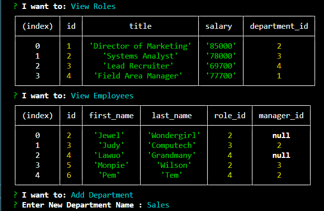

# Employee-Tracker

## Table of contents

- [Overview](#overview)
 - [The challenge](#the-challenge)
  - [User Story](#user-story)
  - [Acceptance Criteria](#acceptance-criteria)
  - [Screenshot](#screenshot)
  - [Links](#links)
- [My process](#my-process)
  - [Built with](#built-with)
  - [What I learned](#what-i-learned)
- [Author](#author)


## Overview

### The challenge
This project deliverable is a command-line CMS that manages a database using Node.js, Inquirer, and MySQL.


### User Story

AS A business owner
I WANT to be able to view and manage the departments, roles, and employees in my company
SO THAT I can organize and plan my business

### Acceptance Criteria

GIVEN a command-line application that accepts user input
WHEN I start the application
THEN I am presented with the following options: view all departments, view all roles, view all employees, add a department, add a role, add an employee, and update an employee role
WHEN I choose to view all departments
THEN I am presented with a formatted table showing department names and department ids
WHEN I choose to view all roles
THEN I am presented with the job title, role id, the department that role belongs to, and the salary for that role
WHEN I choose to view all employees
THEN I am presented with a formatted table showing employee data, including employee ids, first names, last names, job titles, departments, salaries, and managers that the employees report to
WHEN I choose to add a department
THEN I am prompted to enter the name of the department and that department is added to the database
WHEN I choose to add a role
THEN I am prompted to enter the name, salary, and department for the role and that role is added to the database
WHEN I choose to add an employee
THEN I am prompted to enter the employee’s first name, last name, role, and manager, and that employee is added to the database
WHEN I choose to update an employee role
THEN I am prompted to select an employee to update and their new role and this information is updated in the database

### Screenshot




### Links

- Solution URL: [Employee-Tracker](https://github.com/Monkonjay/Employee-Tracker)
- Live Site: [Video Demo](https://drive.google.com/file/d/1GjM5s1komkhy3dZAqJEBgg9vDS3fYY1F/view)

## My process

### Built with

- node.js
- inquirer
- MySql


### What I learned

During this project, I practiced connecting node js with a MySQL dataabse and using inquirer to capture the user's input to query and update the database. 


```Javascript node.js, mySQL
  connection.query("INSERT INTO role SET ?", {
                title: response.title,
                salary: response.salary,
                department_id: response.departmentId
            })
```


## Author

- Website - [Robert M Greene]( https://monkonjay.github.io/Portfolio/)
- Github - [Monkonjay](https://github.com/Monkonjay)